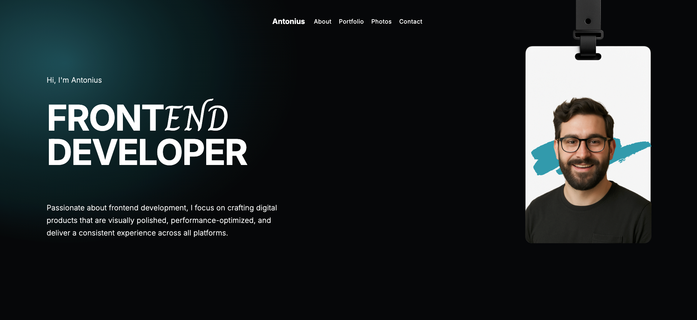

# Personal Portfolio Website

A simple **personal portfolio website** using **native HTML and CSS**
This project was created to showcase personal information, skills, and projects in a clean layout without relying on any frameworks or external libraries.

The goal of this project is to demonstrate a solid understanding of **fundamental web development concepts**, including semantic HTML structure, and clean CSS styling.

---

## Preview



---


## Features

- Clean and minimal user interface
- Semantic HTML Structure
- using aria-label in main navigation
- Using Google Fonts : Inter and Charm
- Sticky/absolute header using tranparent visual effect
- Using CSS Grid for Portfolio showcase section
- Contact form using fieldset, legend, radio button for preferred contact method, dropdown reason for contact

---

## Tech Stack

This project intentionally uses **pure web fundamentals**

| Technology | Description |
|-----------|-------------|
| HTML5 | Structure of the web pages |
| CSS3 | Styling, layout, and responsiveness |
| Flexbox / Grid | Layout management |

Explanation:

- **index.html** → Main entry page of the website  
- **style.css** → Main stylesheet for all styling rules  
- **assets/** → Folder containing images and icons used in the website  
- **README.md** → Documentation of the project

---

## Getting Started

To run this project locally, follow these steps:

### 1. Clone the repository

```bash
git clone https://github.com/Revou-FSSE-Feb26/milestone-1-AI-NovaNX.git
```

---

### 2. Navigate to the project folder

```bash
cd milestone-1-AI-NovaNX
```

---

### 3. Open the project

Open ```index.html``` directly in your browser

For a better development experience you can also run the project using VS Code Live Server

---

## Learning Goals

This project focuses on strengthening the following skills:
- Writing clean **semantic HTML**
- Creating layouts using **CSS Flexbox and Grid**
- Organizing project structure properly
- Understanding the **foundation of front-end development**

---

## Deployment

This project can be deployed using GitHub Pages

Example deployment URL :

```bash
https://revou-fsse-feb26.github.io/milestone-1-AI-NovaNX/
```

---

## Future Improvements

Possible improvements for future development:

- Implement responsive design

- Implement dark mode

- Add JavaScript for interactivity

- Add animation

---

## Author

### Antonius Eko Indriarto

A front-end developer learner who is passionate about building modern web interfaces and continuously improving web development skills.
