# Personal Portfolio Website

A responsive **personal portfolio website** built with **semantic HTML5** and **modern CSS3**, designed to present personal information, skills, and selected projects in a clean and professional layout without relying on frameworks or external libraries.

This project highlights a solid understanding of **core front-end fundamentals**, including semantic structure, responsive layout techniques, visual hierarchy, and maintainable CSS styling.


---

## Preview

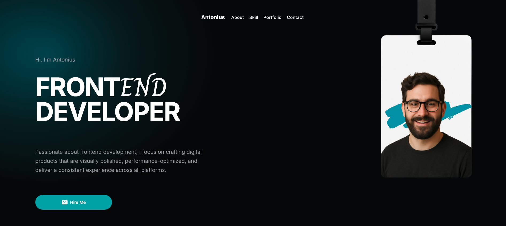

---

## Live Demo

[View Live Website](https://revou-fsse-feb26.github.io/milestone-1-AI-NovaNX/)

---

## Tech Stack

This project intentionally uses **pure web fundamentals**

| Technology        | Description                                 |
| ----------------- | ------------------------------------------- |
| HTML5             |  Provides the semantic structure of the website                 |
| CSS3              | Handles styling, layout, and visual presentation          |
| Flexbox / Grid    |  Supports flexible alignment and spacing across sections                         |
| Responsive design | Ensures usability across mobile, tablet, and desktop devices |

Explanation:

- **index.html** → Main entry page of the website
- **style.css** → Main stylesheet for all styling rules
- **public/** → Stores images, icons, and visual assets used in the website
- **README.md** → Project documentation

---

## Getting Started

To run this project locally, follow these steps:

### 1. Clone the repository

```bash
git clone https://github.com/Revou-FSSE-Feb26/milestone-1-AI-NovaNX.git
```

---

### 2. Navigate to the project folder

```bash
cd milestone-1-AI-NovaNX
```

---

### 3. Open the project

Open `index.html` directly in your browser

For a smoother development workflow, you can also run the project using VS Code Live Server.

---

## Learning Goals

This project was created to strengthen the following front-end development skills :

- Writing clean and semantic **HTML structure**
- Building layouts with **Flexbox and CSS Grid**
- Applying **responsive design principles** across different screen sizes
- Organizing a project structure clearly and consistenly
- Strengthening the foundation of **front-end web development**

---


## Key Features 
_(Click the arrow " ▶ "  or the feature title below to view more details)_

<details>
	<summary><strong>1. Fixed Header with glass blur effect</strong></summary>

The website includes a fixed header that remains consistently positioned at the top of the page, ensuring that navigation stays visible and accessible regardless of the user’s scroll position. As content moves beneath it, the header reveals a subtle glass blur effect that creates a polished frosted-glass appearance while maintaining clarity and readability.

This implementation improves usability by keeping key navigation elements within reach at all times and contributes to a cleaner, more modern browsing experience.

In addition, all navigation buttons are fully functional and allow users to move smoothly to their intended sections or destination links.

[](https://www.webmobilefirst.com/en/screencasts/euyo4kje92r2zb/)

<mark>Click the image above to view the demo video in a new tab. Don't forget to klik play " ▶️ " button)</mark>

</details>

<details>
    <summary><strong>2. Radial gradient in Hero Background</strong></summary>

The hero section uses a radial gradient background to add visual depth and highlight the opening area of the page. This design choice helps direct the user’s attention to the main introduction while creating a modern and engaging first impression.

By using a smooth gradient transition, the hero area feels more refined without distracting from the content itself.

</details> 

<details>
    <summary><strong>3. Hero Title Typography Combination</strong></summary>

The hero title combines **Inter** and **Charm** to create a balanced visual identity between readability and artistic expression. **Inter** provides a clean, modern, and highly legible foundation, while **Charm** adds a distinctive decorative touch that reinforces the creative theme of the website.

This combination helps the heading feel more memorable and visually aligned with the portfolio’s artistic character.

</details>

<details>
    <summary><strong>4. Marquee-style logo animation</strong></summary>

The website features a marquee-style logo animation that presents trusted brand identities in a continuous horizontal flow. This creates a more dynamic visual presentation while also reinforcing credibility and professional appeal.

Beyond its visual value, this section is intended to communicate trust, reliability, and confidence in the quality of the design work being presented.

[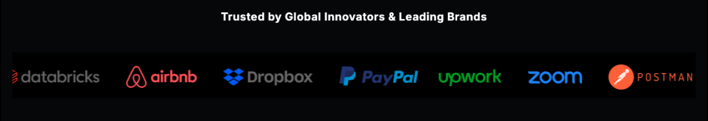](https://www.webmobilefirst.com/en/screencasts/-nqrleyxz9_nyf/)
<mark>Click the image above to view the demo video in a new tab. Don't forget to click play " ▶️ " button)</mark>
</details>

<details>
    <summary><strong>5. CSS GRID layouting</strong></summary>

The Portfolio section is built using **CSS Grid** with ```auto-fit``` to create a clean, flexible, and visually balanced project layout. This approach allows the cards to automatically adapt to the available screen width without depending on rigid column settings.

By combining CSS Grid with ```auto-fit```, the layout maintains consistent spacing, alignment, and presentation quality across different device sizes. This helps the portfolio feel polished, responsive, and easy to explore.

<br>
<p align="center">
    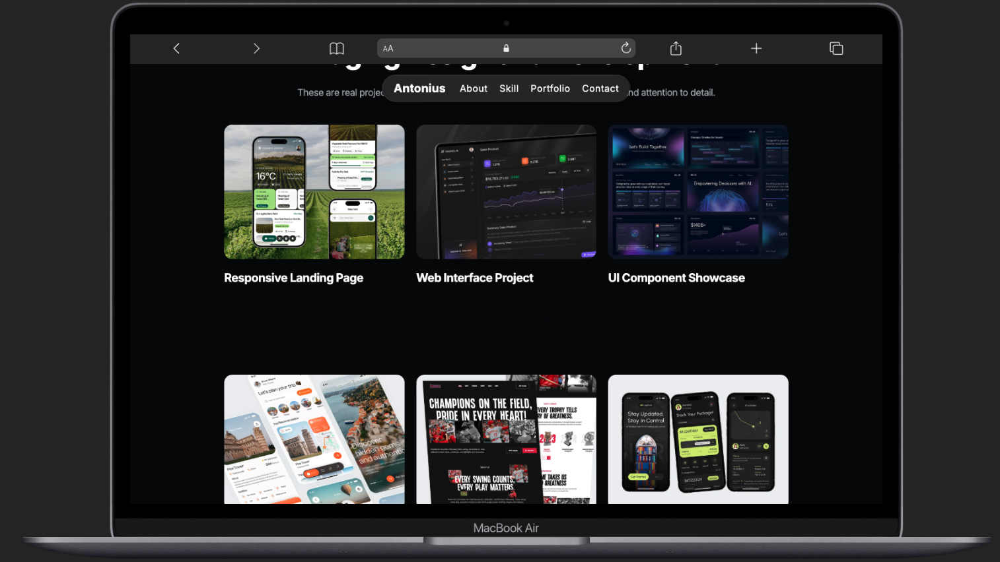<br  >
    <em>Grid 3x2 in Desktop size</em>
</p>
<br>
<p align= "center">
    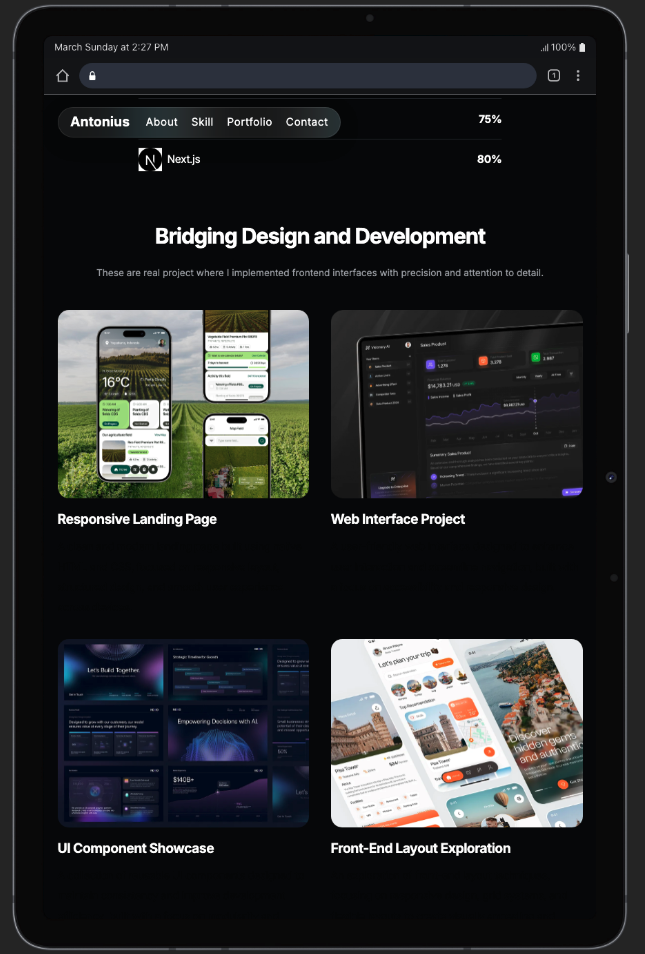<br>
    <em>Grid 2x3 in Tablet size</em>
</p><br>

</details>

<details>
    <summary><strong>6. Responsive design</strong></summary>

The website is designed with a responsive layout strategy to provide a consistent and user-friendly experience across multiple screen sizes.
- **Mobile devices (```max-width 765px```)**
The layout is optimized for smaller screens by improving content flow, readability, and touch accessibility. In this view, the navigation menu is accessed through a burger menu button in the header, allowing users to navigate comfortably without overcrowding the interface.
- **Tablet to small desktop devices (```768px to below 1280px```)**
The layout adjusts to provide better spacing, alignment, and content balance while making fuller use of the available screen width.
- **Desktop devices (```1280px and above```)**
The layout expands into a more spacious and structured presentation, making the interface feel cleaner, more stable, and more professional.

This implementation reflects attention to usability, adaptability, and modern front-end development practices across a wide range of devices.

**a. Mobile devices (```max-width 765px```)**
<br>
[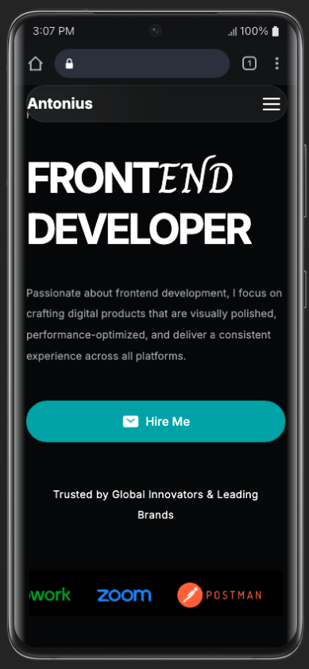](https://www.webmobilefirst.com/en/screencasts/ffgu-uvpmk4h16/)
<br>

**b. Tablet to small desktop devices (```768px to below 1280px```)**
[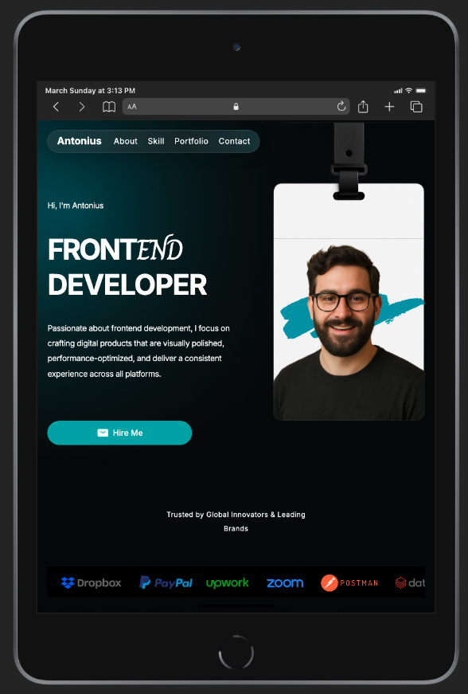](https://www.webmobilefirst.com/en/screencasts/krojlkclzjy8jp/)
<br>

**c. Desktop devices (```1280px and above```)**

[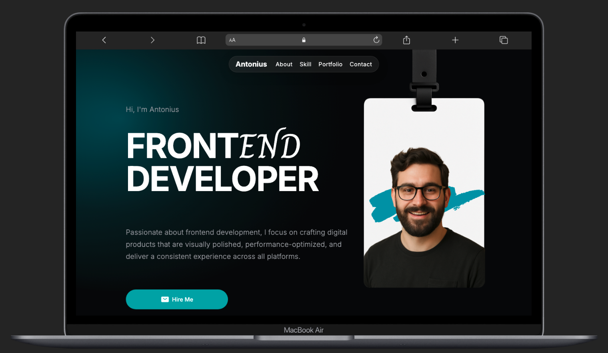](https://www.webmobilefirst.com/en/screencasts/qwi0allvs452fr/)
<br>

<mark>Click any image above to view the corresponding demo video in a new tab. Don't forget to click play " ▶️ " button)</mark>

</details>

<details>
    <summary><strong>7. Portfolio Detail Popup Modal</strong></summary>

When a portfolio image is clicked, a popup modal appears to display more detailed information about the selected project. This allows users to explore the portfolio in a more interactive and focused way without leaving the current page.

By presenting additional context, highlights, or supporting information in a dedicated overlay, the website creates a smoother browsing experience while keeping the main interface clean and visually organized.

<br>
<p align="center">
    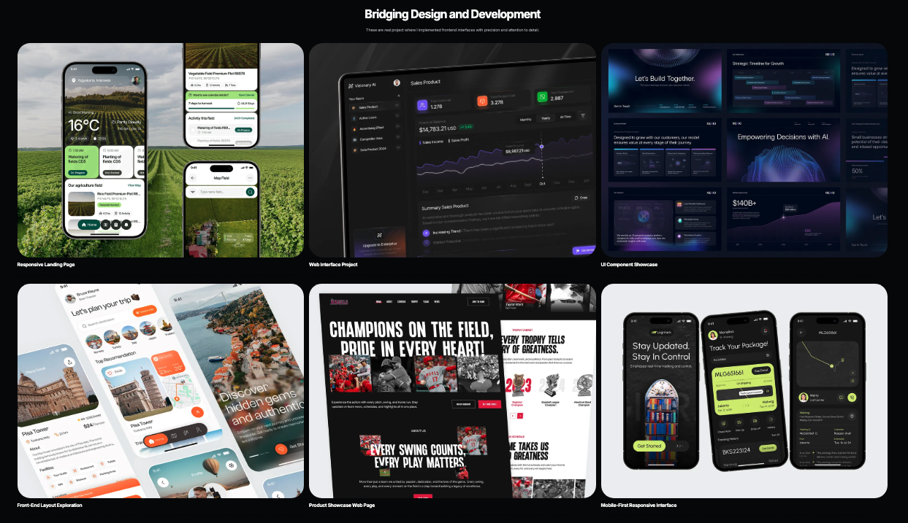<br  >
    <em>Initial state</em>
</p>
<br>
<p align= "center">
    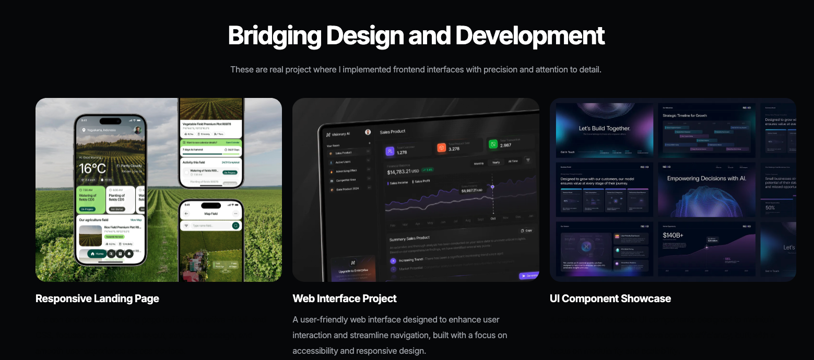<br>
    <em>Popup Information when a portfolio image clicked</em>
</p><br>

[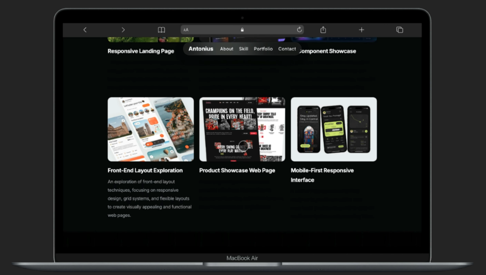](https://www.webmobilefirst.com/en/screencasts/9h3w1in1o0-onn/)
<br>

<mark>Click the image above to view the demo video in a new tab. Don't forget to click play " ▶️ " button)</mark>

</details>

---
## Additional Implementation Details

### Flexbox for Section Layouts

The website makes extensive use of Flexbox to create clean, flexible, and well-aligned layouts across different sections. This helps manage spacing, alignment, and content distribution more efficiently while keeping the interface responsive and visually balanced.

<br> <p align="center"> 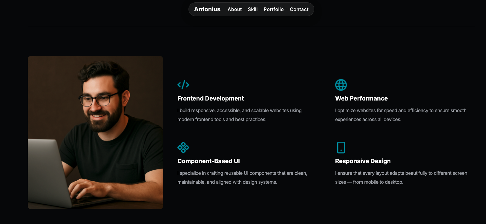<br> <em>About section in desktop view</em> </p> <br> <p align="center"> 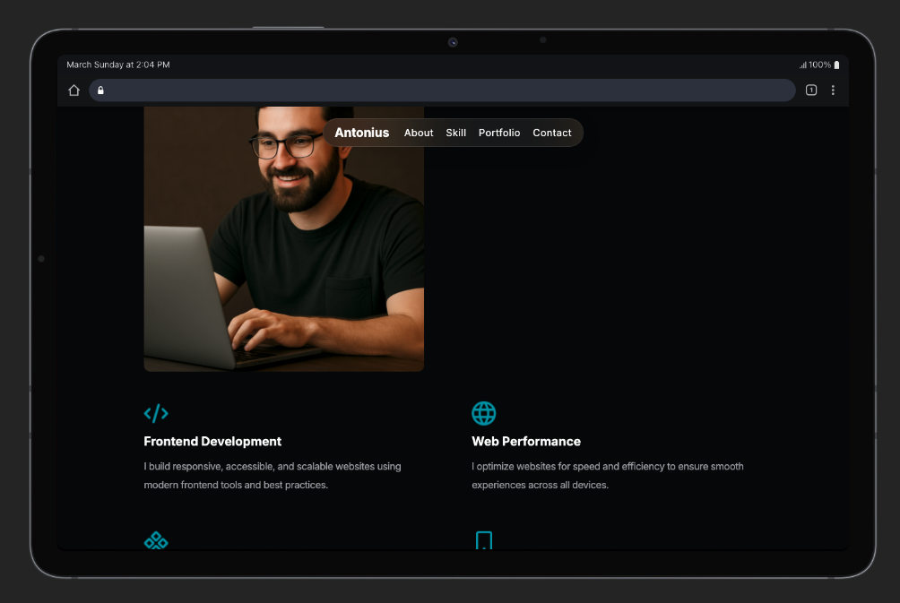<br> <em>About section in tablet view</em> </p>

### Button with Text and Icon

The website uses buttons that combine text labels with icon images to make actions clearer and more visually engaging. This helps users understand the purpose of each button more quickly while keeping the interface consistent with the overall visual style.

To align the envelope icon inline with the adjacent text, the following CSS rule is applied:

``` CSS
.btn-primary img {
  vertical-align: middle;
}

```
---

## Deployment
This project can be deployed using **GitHub Pages**

### Deployment URL:
https://revou-fsse-feb26.github.io/milestone-1-AI-NovaNX/

---

## Future Improvements

Possible areas for future development include:
- Adding **dark mode theme**
- Enhancing interactivity with **JavaScript**
- Introducing smoother **animations and transitions**
- Refactoring styles for better **maintainability and scalability**

---

## Author

### Antonius Eko Indriarto

A front-end developer learner who is passionate about building modern web interfaces and continuously improving practical web development skills.
